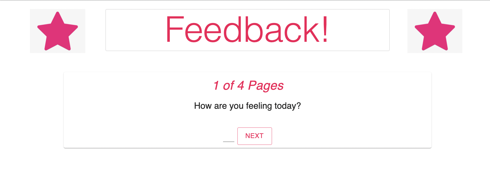
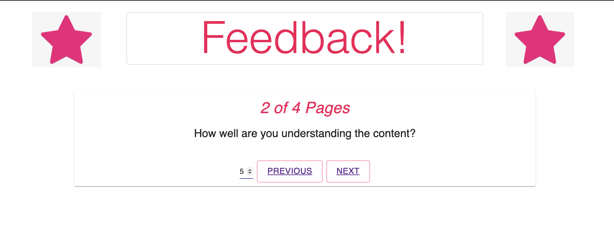
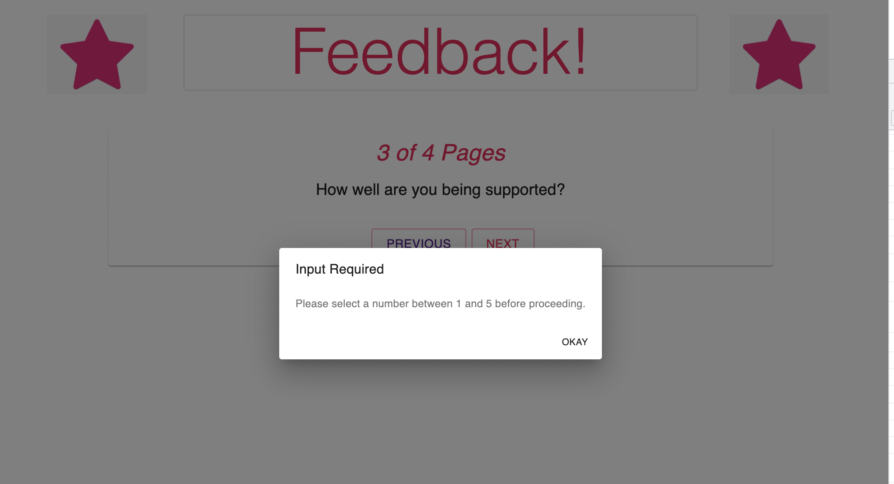
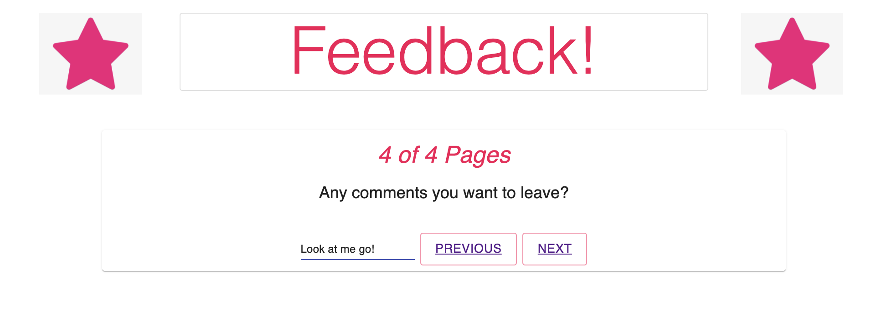
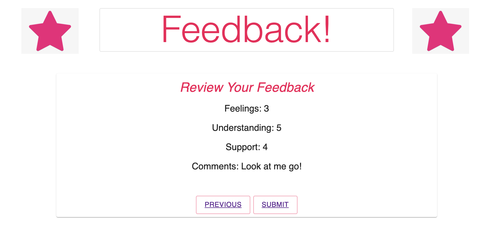
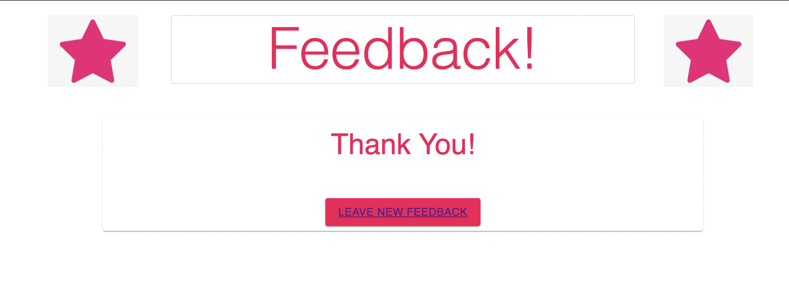
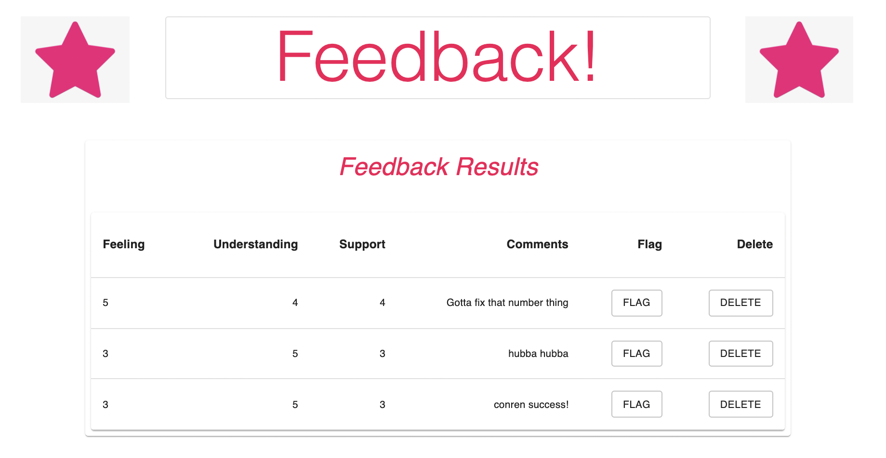

   
    
# Redux Feedback Loop

## Table of Contents

- [Description](#description)
- [Screenshots](#screenshots)
- [Built With](#built-with)
- [Getting Started](#getting-started)
  - [Prerequisites](#prerequisites)
  - [Installation](#installation)
- [Usage](#usage)
- [License](#license)
- [Acknowledgements](#acknowledgements)
- [Contacts](#contacts)

## Description

For this assignment, I created a reflection/feedback form modeled after Prime's system. Feedback is collected over 4 views. In a separate review page, the current feedback values are displayed along with a submit button. When all steps are complete, the app saves the feedback in the database. On a separate admin page, all submitted feedback is displayed with options to delete feedback or flag it for follow-up purposes.

## Screenshots

## Built With

## Getting Started

### Prerequisites

Express - a web framework for Node.js Postgresql - an open source relational database

### Installation

There is a database.sql file to use to set up a database. After that once you fork and clone the repository, you should be able to run the server and client to be able to use the app.

## Usage

On the homepage, enter a number between 1 and 5 that represents how you are feeling this week. When you click 'Next', you will be routed to the next page which will ask you how well you are understanding the material. Continue the steps through the support page, and enter any comments you have on the comments page. Then you will be asked to review your feedback before you submit, with the option to go back to a previous page and edit your answers. Once you click submit, your feedback will be added to the database and you will be routed to a confirmation page, with the option to be rerouted to the homepage and leave new feedback. If you go to /admin, you will be able to see all details of feedback that has been submitted, with the option to delete or flag feedback for follow-up.

Continuing goals with this project are to work out conditional rendering for the flagged and unflagged items on the /admin page, and to display the feedback in order of the time submitted. I would also like to deploy this one with Heroku and complete the final stretch goal for this assignment!

## Acknowledgements

Thank you to all of my Ionian cohorts that helped me work out the snags with this one, and to my instructor Dev!

## Contacts

  